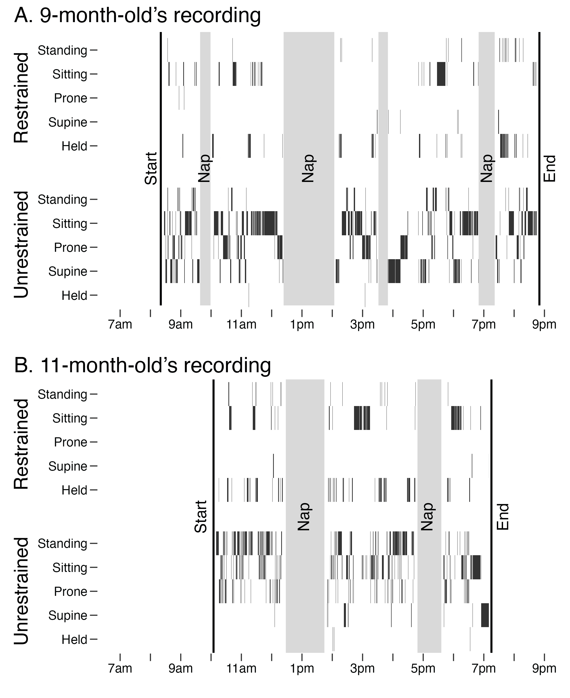
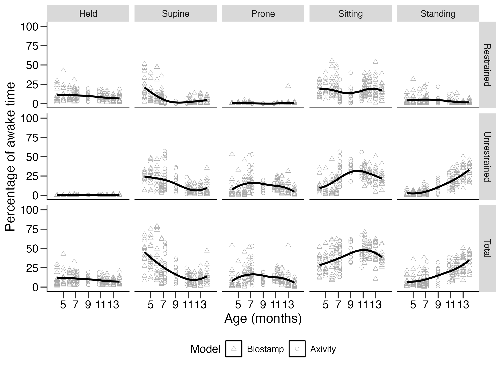

```{r}
#| include: false
set.seed(2025)
knitr::opts_chunk$set(cache.extra = knitr::rand_seed)

library(tidyverse)
library(flextable)
library(ftExtra)
library(conflicted)
library(papaja)
conflicts_prefer(purrr::discard)
conflicts_prefer(dplyr::filter, .quiet = TRUE)
conflicts_prefer(dplyr::lead, .quiet = TRUE)
conflicts_prefer(dplyr::lag, .quiet = TRUE)
conflicts_prefer(flextable::separate_header, .quiet = TRUE)
conflicts_prefer(flextable::theme_apa)
conflicts_prefer(janitor::make_clean_names, .quiet = TRUE)

metrics <- read_csv("metrics.csv")
```

Everyday learning inputs—visual experiences, object interactions, and social exchanges—are filtered by infants' movements. In this chapter, I focus on two aspects of movement: position and restraint. Position refers to the configuration of the body with respect to gravity, such as lying supine on the back, prone on the stomach (whether stationary or crawling), sitting, or standing upright (whether stationary or walking). Infants' position from moment to moment shapes their view of objects and faces [@LuoFranchak2020; @KretchFranchak2014], constrains how they explore objects in their hands [@SoskaAdolph2014; @KretchMarcinowski2022], and predicts the frequency of adults' speech [@RouseyTang2026]. Restraint refers to infants' opportunity to switch positions [@WangRousey2026]. When infants are restrained, such as held in a caregiver's arms or strapped into a car seat or high chair, they cannot change positions. When unrestrained, infants can voluntarily switch between positions, provided they have sufficient skill to do so. Restraint also shapes everyday learning inputs: Infants have broader views of the environment when carried off the ground [@KretchAdolph2015], but infants have less access to objects [@FranchakKadooka2024] and hear less adult speech when restrained [@MalachowskiSalo2023].

Thus, infants' opportunities for learning depend on everyday position and restraint times, which vary according to infants' age, motor skill development, and caregiving choices. With age, infants spend less time supine and restrained and spend more time sitting and standing [@KretchLuna2025; @FranchakKadooka2024; @Franchak2019aa; @FranchakRousey2026]. Infants who can sit independently spend more time sitting unrestrained [@KretchLuna2025], and infants who can walk independently spend more time standing upright [@FranchakRousey2026]. Despite these developmental trends, there are considerable individual differences that depend on caregiving practices and daily routines. Whereas some caregivers may choose to more often use specialized devices like swings, jumpers, and exersaucers [@CallahanSisler1997; @KarasikKuchirko2022], others may more often choose to hold infants in their arms or position infants on the floor. Caregivers' choices about daily activities, such as errands and meals, also matter: Infants spend more time restrained when out of the house on errands and during mealtime [@FranchakFord2026].

Consequently, position and restraint are distributed heterogeneously throughout the day. An hour spent playing might involve a long bout of time unrestrained during which the infant switches between sitting, prone, and standing positions. An hour spent eating a meal might involve a continuous bout of sitting while restrained in a high chair. An hour spent playing, fussing, and nursing could involve frequent switches between laying on the couch, crawling on the floor, and being held in caregivers' arms. This poses a challenge for researchers who wish to measure everyday position and restraint, because sampling any single hour might fail to capture the full variation in movement across a day. Most video observations of infants' home behavior sample 1-2 hours at most [e.g., @HerzbergFletcher2021], meaning that other parts of the daily routine go unobserved. Capturing a full waking day of infants' movements on video would also mean labor-intensive video coding, which could take as many as 5 hours per hour of video to annotate [@FranchakTang2024].

Categorizing infant movement from wearable sensors provides an alternative that is well-suited to collecting full-day behavior in the home. Customized sensor garments that embed one or more inertial measurement units (IMUs) into infant leggings or "onesies" can be worn for an entire day or multiple days, recording temporally-rich data wherever the infant goes [@AiraksinenRasanen2020; @FranchakTang2024; @GreenspanCunha2021; @McElwainFisher2024]. Collecting and annotating a relatively small amount of ground truth video has allowed researchers to train machine learning models that categorize infant position [@AiraksinenRasanen2020; @FranchakTang2024; @KretchEnriques2026] and holding/restraint [@WangRousey2026; @AiraksinenGallen2022; @YaoPlotz2019] from the IMU signals, reducing the labor costs of measuring long durations of behavior.

In the remainder of this chapter, I describe how to collect wearable sensor data, process and train machine learning models, and evaluate model accuracy for infant movement detection in the home. Although I focus on the workflow developed in my lab for categorizing infant position and restraint [@FranchakTang2024; @KretchEnriques2026; @WangRousey2026], the approach could be extended to categorize other movements across different participant populations. Indeed, the same workflow has allowed us to train models to categorize when infants' adult caregivers are standing upright throughout the day. I end the chapter with a review of current and future applications that can leverage full-day wearable sensor detection of natural movement.

# Data Collection

The first studies categorizing infant movement from wearable sensors tested infants in brief, supervised observations in controlled laboratory settings where the entire session was video-recorded for ground truth validation [@AiraksinenRasanen2020; @FranchakScott2021]. Here, I highlight the methodological issues of later studies that collected data in participants' homes across the full day [@FranchakTang2024; @KretchEnriques2026; @WangRousey2026]. Whereas laboratory observations mostly focus on infant unrestrained play, testing across a day in the home requires models that can handle a wide range of behaviors beyond play, such as bouts of time spent held and restrained. Importantly, because training data based on laboratory behavior are unlikely to generalize to full-day home behavior [@deBarbaroMadden-Rusnak2026aa], we train and validate models completely based on sensor and video data collected in the home. Full days are too long to exhaustively video record and annotate, so data collection begins in the morning with the infant wearing the sensor garment during a video recorded segment for model training/validation, which is followed by a sensor-only recording that captures infants' movements until they go to sleep at the end of the day.

## Sensor Garment

Collecting full-day data requires infants to be able to comfortably wear the sensors wherever they go, which means embedding the IMUs into a sensor garment. The sensor garment must be snug against the body to ensure that IMUs only pick up movements of the infant's body and so that IMUs remain in the same anatomical location. For example, a poorly designed sensor garment that allows the ankle sensor to bounce while the infant walks or to slide from the medial to lateral surface of the ankle would be difficult to robustly model. Securely fastening the sensors in pockets or with snaps prevents infants from handling sensors, which could be unsafe, and ensures that sensors stay in the desired location. Researchers have arrived at different solutions for sensor garments and placement. @AiraksinenGallen2022 placed sensors on the upper segments of infants' left and right arms and thighs in a onesie. Our lab embeds sensors on infants' left and right ankles and hips in a pair of snug leggings [@FranchakTang2024]. Both types of placement yield accurate models. However, different placements mean that models are not interoperable; each model is specific to the number and locations of sensors used at training.

Choosing the number of sensors means balancing costs and benefits. It is more expensive and more complicated to use more sensors, but gathering data from different anatomical locations yields more accurate models. For example, we found that median model accuracy decreased from 89.4% with four sensors to 70%-85% when using only one of the four sensors [@FranchakTang2024]; @AiraksinenRasanen2025 found similar performance decrements when reducing sensor number. Sensor modalities also matter. @AiraksinenRasanen2025 found that models that incorporate both accelerometer and gyroscope data outperform acceleration-only models. Other aspects of the sensors, such as sampling rate, are less impactful.

We have used two IMUs models across different investigations, the now-discontinued MC10 Biostamp sensor [@FranchakTang2024] and the Axivity AX6 sensor [@KretchEnriques2026]. Each sensor records triaxial acceleration and gyroscope data at high sampling rate (e.g., 50 Hz), with sufficiently long battery life and on-board storage to capture data across an entire day (or in the case of Axivity, up to an entire week). Small form factors and light weight allow each sensor to be worn across an entire day in a pair of leggings without protruding from the body. Other commercially-available sensors, such as those meant to be worn on adults' wrists, are bulky and contain LCD screens that make them unsuitable to wear in an infant garment.

## Capturing Ground Truth Video

Training and validating a supervised machine learning model requires ground truth data [@PargentSchoedel2022]. For infant position and restraint, we video record the first 1-3 hours of each session using a tripod-mounted action camera (e.g., GoPro) that captures infants' movements. Trained human coders annotate the videos to classify each video frame's position (held, supine, prone, sitting, or standing) and restraint category (restrained or unrestrained). Synchronizing the video codes to the sensor time series allows later model training and testing. As described previously [@FranchakTang2024; @KretchEnriques2026], dropping the sensor garment in view of the video camera and allowing it to sit at rest for a defined interval, such as 30 s, allows researchers to identify what moment in the IMU time series corresponds to a reference point in the video to synchronize across recording devices. Times where the infant is out of the field of view of the camera are excluded from model training/validation.

## Full-Day or Multiple-Day Considerations

Unlike laboratory studies, which can be scheduled to avoid infants' naps and bath times, capturing full-day data means that there are necessary interruptions to sensor recording. Machine learning models attempt to predict the best category for every data point recorded by sensors, which means they will label times when the sensor garment is crumpled on the floor while the infant takes a bath or when the family leaves the house. Thus, it is important to identify when infants are wearing the sensors to make predictions only during those times. Our approach is to ask caregivers to log the beginning and end of every nap and any other time that infants are not wearing the leggings, such as diaper changes and baths. The example timelines in @fig-timeline show gray rectangles indicating excluded times based on caregiver logs. Caregivers also remove the leggings and log any times when they leave the house (e.g., trips to the grocery store or walks around the neighborhood). Although it is possible for infants to wear the leggings out of the home, current models are not validated to distinguish transport activities such as riding in a car or stroller.

Thus, the full recording time from when infants first put on the leggings until they take them off before bedtime (the time between the start and end lines on @fig-timeline) is longer than the amount of usable data when infants are awake and wearing the sensors (times in @fig-timeline with predictions). In our past work, we recorded 136 sessions from 67 infants in hopes of capturing the full waking day [for a more detailed description of the dataset, see @RouseyTang2026; @FranchakRousey2026]. Full recording time ranged from 2-12 hours (median = 9.8) and usable data time ranged from 2-10.5 hours (median = 5.8). Shorter usable recording time resulted from long excursions out of the house combined with long naps at home.

In ongoing work, we are recording multiple days of data from each participant to investigate the day-to-day consistency of motor experiences. Although the Axivity sensors can easily record data for a full week, adding additional days of data collection introduces additional challenges. First, caregivers must switch the sensors into a clean garment each day, which requires clear labels and instructions to ensure that sensors are placed in the correct location and orientation. Second, long recordings can introduce timing drift due to small differences in the internal clocks of each sensor. By creating a synchronization point each morning (the caregiver drops the sensor garment on the floor) we can correct for drift to ensure that the sensors are synchronized.

# Data Processing and Model Training

After picking up the sensor garment from the family, researchers return to the laboratory to download the raw sensor data and begin data processing. Each of the four sensors records a time series of linear acceleration (X/Y/Z in *g*s) and rotational velocity (roll/pitch/yaw in degrees/s) at 50 Hz. We pre-process the data by summarizing the raw data into a time series of motion features that describe sensor movements for pre-specified windows of time (e.g., each 4-s period). Once these motion features are joined with ground truth annotations from video coding, machine learning models can be trained and validated. Below, I describe the processing steps and summarize previously-published validation metrics for the position [@FranchakTang2024; @KretchEnriques2026] and restraint [@WangRousey2026] models.

## Extracting Motion Features

Movements take place over time, but each raw sensor sample describes the instantaneous acceleration and rotation for a moment in time. In order to categorize position and restraint from those samples, we summarize how the raw data samples behave within a pre-specified window of time, most commonly 4 s. With sensors sampling at 50 Hz, that means that each 4 s window contains 200 samples of raw data. Following past work [@NamPark2013], we summarize those 200 samples by calculating a series of single-value statistics for each of the 24 sensor signals—each unique combination of 4 locations (left/right ankle/hip) by 3 axes (X/Y/Z) by 2 modalities (accelerometer/gyroscope). Single-signal features were the minimum, maximum, 25th percentile, 75th percentile, mean, median, skew, kurtosis, standard deviation, and sum of the signal. Additional motion features integrate across multiple sensors, such as the total magnitude of acceleration across the 4 sensors or the correlation in gyroscope pitch signals between the left and right hip. In total, we extract 436 motion features that serve as predictors in machine learning models to predict the ground truth model that corresponds to each window. Note that the windowing and feature engineering are steps needed for the particular machine learning models we fit; other classes of models, such as neural networks, use different pre-processing steps [see @AiraksinenRasanen2020; @AiraksinenRasanen2025].

The pre-processing steps are important because they determine what information is available to the machine learning model to learn how to classify the categories of interest. Tree-based models, such as the random forest, choose which features to use based on their informativeness, so including uninformative or redundant features is not a problem; they are simply filtered out. However, a lack of informative features would result in a poor model. What features are important will depend on the behavior categories the researcher wishes to model and how they might be captured in the movements of the sensors at the chosen anatomical locations. Although the same 436 features we use lead to equally accurate models of position and restraint, they lead to less accurate models of locomotion (crawling versus walking versus stationary). Window length may also relate to model accuracy. If windows are too short, they might not capture enough variation in sensor signals to represent the target behavior. If windows are too long, they cannot represent events of shorter duration. In @WangRousey2026, we found slight differences in restraint modeling performance when comparing between 4 s, 16 s, and 32 s window lengths (87%, 88%, and 89% accuracy, respectively), with longer windows resulting in slightly less biased predictions. Testing multiple window lengths and motion feature sets can allow for performance-driven decisions about pre-processing parameters.

## Model Training and Validation

Evaluating and building machine learning models requires partitioning data into training and testing sets [@PargentSchoedel2022]. Training data sets are used to build a model, and testing data sets are used to evaluate the model using data that did not appear in the training set. Allowing testing data to appear in the training set could lead to overfitting, whereby the model appears to perform well because it has learned idiosyncratic features of the data set that do not generalize. More robust tests hold out entire participant sessions from the data set to see how well the model can generalize to new cases. In our past work [@FranchakTang2024; @WangRousey2026; @KretchEnriques2026], we primarily have used leave-one-out cross-validation (LOOCV) in which we rotate through the entire set of participants to hold each participant out as the testing set to see how well a model trained on the remaining participants can generalize. In some cases, we have also created customized training data sets to test specific hypotheses about model composition. For example, when assessing how best to predict body position in infants with cerebral palsy, we discovered that models that mix data from infants with cerebral palsy and with typical development outperform models that contain only a single participant group [e.g., @KretchEnriques2026].

<!--# Individual models? -->

Models can be trained once data are partitioned. We have exclusively used random forest models [@Breiman2001] in our past work because they perform well in multi-class categorization, are resistant to overfitting, and do not require much tuning compared with other models we considered, such as XGBoost and tabnet. Random forest models are easy to implement in R, Python, or Julia on consumer hardware. Although we tune hyperparameters, such as the number of trees and the number of features to select per split, their values have minimal effect on classification performance (\< 1% difference in accuracy).

Once a model has been trained, it can be used to predict classification labels for new exemplars, such as extending to full-day data or new participants for which no ground truth labels exist. @fig-timeline shows full-day predictions for a 9-month-old and an 11-month-old predicted from a model trained from participants in a different study [i.e., @KretchEnriques2026].

## Performance of Position and Restraint Models

To date, we have trained position and restraint models on two independent data sets, one that used Biostamp sensors [@FranchakTang2024; @WangRousey2026] and one that used the Axivity sensors [@KretchEnriques2026]. Aside from the sensor hardware and participants themselves (variation in participant number and ages), all aspects of the procedure were identical across the data sets—sensor placement, ground truth annotation, windowing and motion features pre-processing, LOOCV data partitioning, and random forest modeling. Thus, each model comprises an independent replication of these procedures. @fig-age shows summarized results---daily time spent in each position/restraint combination---by infant age with predictions made from the two different model sets. Moreover, each data set includes infants at 7 and 11 months, allowing direct age-matched comparisons. As @fig-age shows, the summarized data have strong face validity: With age, infants spend less time supine and more time sitting and standing. In particular, older infants spend increasing amounts of time in unrestrained sitting and standing positions as their motor skills develop. More sitting and standing time in younger infants occurred during restraint, such as when supported by a caregiver or placed in an infant seat or exersaucer. Although the position and restraint models are fully independent of each other, they show strong consistency in that moments were rarely classified as unrestrained and held (by definition, impossible) or restrained and prone (unlikely although possible). Of course, the models are not perfect. The notable outlier session that contains a large amount of restrained holding time is likely a classification error.

To better evaluate model performance, we compare model predicted classifier outputs against ground truth human annotations for each window in a given testing data set. It is important to assess multiple metrics of classification performance, especially in data sets with imbalanced frequency of categories (e.g., prone is typically rare and sitting is frequent at all ages). Overall accuracy (percentage agreement between human codes and model predictions) can mask poor prediction of low-frequency categories if the model does well at predicting the most frequent ones [@deBarbaroMadden-Rusnak2026aa]. Other metrics, such as Cohen's kappa, help address class imbalance. Furthermore, by-class metrics quantify how well a model does at detecting true instances of a class (sensitivity) and how likely a prediction of a certain class corresponded with a true event (positive predictive value).

@tbl-metrics summarizes these metrics across the Biostamp and Axivity models of position and restraint by averaging across LOOCV iterations in each data set. Overall, results are consistent across both models with strong accuracy (87%-90%) and kappa values (.70-.84). These metrics compare favorably to inter-rater reliability accuracy (91%) and kappa (.86) agreement statistics for two human coders scoring infants' position. By-class sensitivity and positive predictive values vary somewhat from class to class and from model to model. For example, the Axivity position model has stronger performance for detecting prone, whereas the Biostamp position model has stronger performance for detecting standing. Beyond these metrics, we have validated models in other ways that more directly relate to subsequent analyses, such as correlations between human-predicted prevalence and model-predicted prevalence of a given behavior during the ground truth observation. Strong correlations in the Biostamp position model within each class (*r*(Held) = .92, *r*(Supine) = .82, *r*(Prone) = .85, *r*(Sitting) = .88, *r*(Standing) = .99) indicate that models are suitable to detect relative differences in time spent in each position between individuals or across ages (as in @fig-age). Similar analyses for a "distal comparison" using a video recorded later in the day in participants' homes helped show that model predictions continue to be accurate throughout hours of testing [@FranchakTang2024]. Finally, strong correlations between human-coded and model-predicted bout durations [@FranchakRousey2026; @WangFranchak2026] suggest that model-predicted position events can be used to analyze the temporal structure from second-to-second (rather than only at the scale of the day).

# Advantages and Limitations

Compared to other methods, such as video recording or caregiver surveys, the most important advantage of wearable sensing is the ability to record entire days of behavior. Each data point in @fig-age comprises an average of nearly 6 hours of second-by-second measurements that take place across the daily routine in the home, whereas other methods might average a few dozen survey responses or an hour of video recording. Full-day data are important because, as @fig-timeline shows, a single infant's day varies hour-by-hour in the types of activities that occur. Capturing long durations of behavior mitigates the risk of time sampling bias. Each exemplar infant had at least one long block of restrained sitting time that differed greatly from unrestrained times where they freely switched between prone, sitting, and standing. Estimates of daily position and restraint frequency would vary greatly if we were to sample only the hour that contained those restrained sitting episodes or only hours that excluded such episodes. Temporally-rich data like these have allowed us show how the pace of everyday motor events changes with respect to infants' age and motor milestone acquisition [@FranchakRousey2026; @WangFranchak2026]. In future work, multiple-day recording will allow us to relate day-to-day consistency in motor behaviors to subsequent developmental outcomes.

Another advantage of continuous wearable sensor recordings is that they can be integrated with other types of in-home sensing technologies [for a review, see @KaurKumar2026]. For example, our lab paired wearable sensor recordings with LENA audio recorders that automatically detect the frequency of adult speech that infants might hear [@RouseyTang2026]. Synchronizing position and LENA signals allowed us to discover that within a day, infants hear relatively more words when they spend more time held by a caregiver or sitting. A new model that detects caregiver standing throughout the day will allow us to test how infants' and caregivers' movements are synchronized to one another across a day. Other research groups collect wearable sensor streams that include physiological data [@McElwainFisher2024] and infant-caregiver proximity [@SaloPannuto2021] that provide additional ways of characterizing naturalistic social interactions. However, all of these examples highlight the largest drawback of wearable sensing, which is the lack of contextual information in comparison to video recording. Whereas videos capture everything that can be seen or heard, classification of sensors can only classify outcomes for which models are available. Although we can detect position and restraint from wearable sensors, those data alone cannot tell us about other variables of interest, such as the specific seat the infant is restrained in or whether they are holding an object. Whereas it is easy to check back to a video to see if a code was correct, we cannot check the accuracy of predictions during non-video recorded portions of the day.

With these advantages and limitations in mind, there are many future applications for wearable sensing. Careful application requires validating predictions when applied to new samples [@deBarbaroMadden-Rusnak2026aa]. For example, we showed that position predictions were accurate among infants with cerebral palsy [@KretchEnriques2026], enabling future studies to examine the impacts of motor delay on full-day motor experiences or to test the efficacy of clinical interventions in movement outcomes in that population. @AiraksinenPalsa2026 have developed an automated motor skill metric derived from their wearable sensor recordings that is strongly correlated with the Alberta Infant Motor Scale, which requires a trained experimenter to administer and score. Automating clinically-relevant metrics has the potential to gather outcomes in settings where a clinical observation is not feasible.

# References

::: {#refs}
:::



```{r tbl-metrics}
#| tbl-cap: Performance of position and restraint models for two data sets
#| apa-note: Biostamp performance values are means across 146 LOOCV iterations and Axivity model values are means across 55 LOOCV iterations.

metrics %>% 
  flextable() %>% flextable::theme_apa() %>% line_spacing(part = "all") %>% 
  padding(padding.top = 2, padding.bottom = 2) %>% 
  set_header_labels(Biostamp_Position = "Biostamp", Biostamp_Restraint = "Biostamp", Axivity_Position = "Axivity", Axivity_Restraint = "Axivity" ) %>% 
  add_header_row(values = c("", "Position", "Restraint"), colwidths = c(2,2,2)) %>% 
  merge_v(j = "Metric") %>% fix_border_issues() %>% 
  hline(i = c(2,9)) %>% 
  set_table_properties(layout = "autofit", width = .6) %>% 
  align(align = "center", part = "all")

```



```{r fig-timeline}
#| fig-cap: Full-day timelines for two infants 
#| fig-width: 6.5 
#| fig-height: 6.5 
#| apa-note: Full-day timelines of position and restraint for exemplar (A) 9-month-old and (B) 11-month-old infants. Each black rectangle indicates the machine learning model prediction of restrained (top row) and unrestrained (bottom row) positions. Vertical lines mark the start and end times of each recording and gray rectangles signify nap times when data were excluded. 


```



```{r fig-age}
#| fig-cap: Full-day predictions of position and restraint time by age 
#| fig-width: 7.5 
#| fig-height: 6 
#| apa-note: Each column shows one position's time when restrained (top row), unrestrained (middle row) or in total (bottom row). Each point indicates data from one infant's session. Solid black lines indicate LOESS trends with age in months. Sessions were drawn from studies that used two different inertial sensors with different corresponding models (triangular points indicate Biostamp sensors, circular points indicate Axivity sensors). Data from both models at 7 and 11 months suggest that both models yield similar results. 


```
